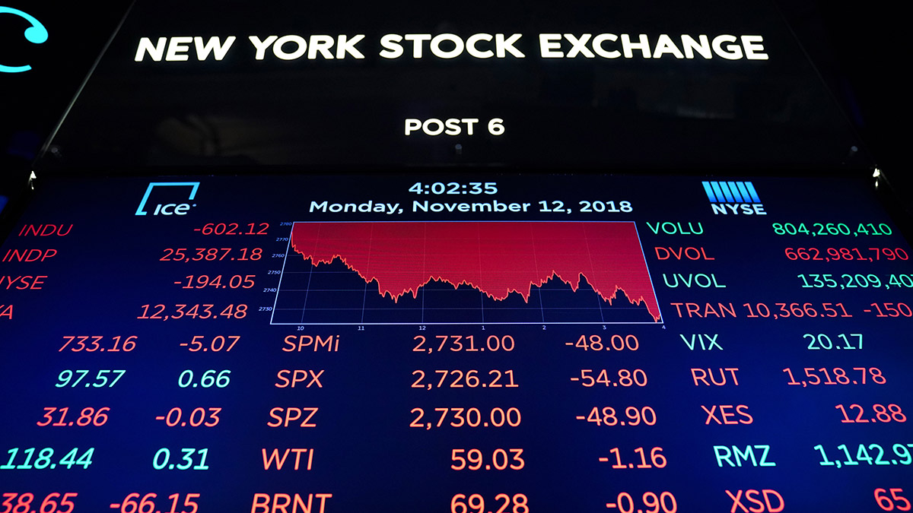
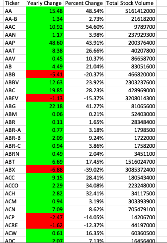
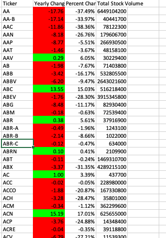
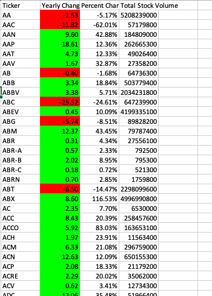

# Stock Market Analysis with VBA

---

---

## Contact Information

Rob Savage 

rob.savage@me.com

[LinkedIn](https://www.linkedin.com/in/robsavage/)

[Tableau Public](https://public.tableau.com/profile/rob.savage)

---

## Project Description

The purpose of this project was to utilize VBA to analyze stock data. This was my first venture into the world of coding and I immediately understood how inefficient Excel was at dealing with relatively large data sets.

---

## Tools Used

1. Excel/VBA

2. Github (Publishing of Results and Analysis)

---

## Objectives

Create a script that will loop through all the stocks for one year and output the following information.

- The ticker symbol.

- Yearly change from opening price at the beginning of a given year to the closing price at the end of that year.

- The percent change from opening price at the beginning of a given year to the closing price at the end of that year.

- The total stock volume of the stock.

